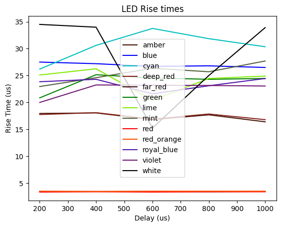
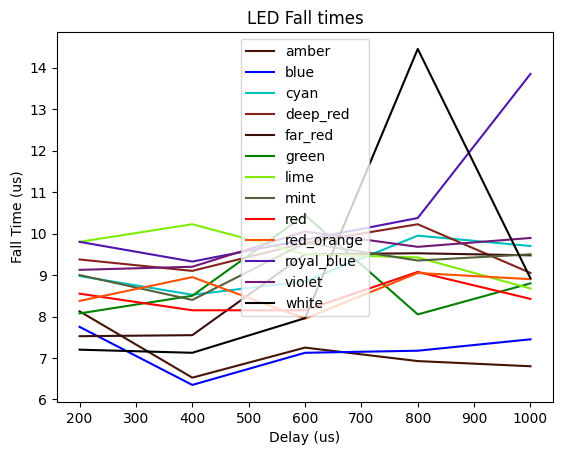
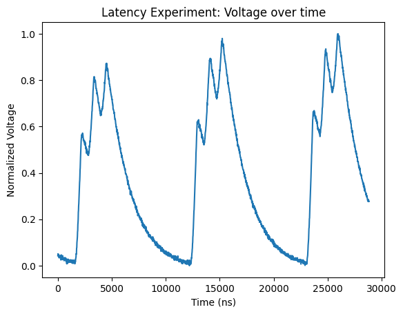

# hsi-timings

This repository contains experiments for measuring LED timings for the HSI coded camera project. We measure the following:
1. LED rise and fall timings
2. The execution time for digitalWrite

## Experiment 1: LED rise and fall timings
LEDs take time to rise to maximum intensity and fall to 0 intensity. To avoid LED illumination mixing, these timings must be characterized.

## Setup
A single LED is turned on and off at intervals (200μs, 400μs, 600μs, 800μs, 1000μs). The illumination is captured by a photodiode, whose response is recorded by a oscillscope. The resultant signal is a square wave with a measurable rise and fall.

We capture a window around the rise at a scale of 5μs (500MSa/s) and around the fall at a scale of 10μs (1000MSa/s). This data is then exported via .csv by the scope and later processed in `risefall.ipynb`.

## Sample Arduino Code

```
int led = ...;
int delayUs = ...;

void setup() {
    pinMode(led, OUTPUT);
}

void loop() {
    digitalWrite(led, delayUs);
    delayMicroseconds(delayUs);
    digitalWrite(led, delayUs);
    delayMicroseconds(delayUs);
}
```

## Results
The collected data is stored in `data/risefall`. The resultant plots are generated by `risefall.ipynb`:




In general, rise times are < 35μs and are LED dependent. The red and red-orange LEDs are particularly fast, with < 5μs rise times.

Fall times are generally < 15μs and are consistent across LEDs.

## Experiment 2: digitalWrite execution time

### Setup
A single LED (in this case, violet) is chosen. This LED is switched on/off as fast as possible three times per Arduino loop iteration. The illumination is captured by a photodiode, whose response is recorded by a oscillscope. The resultant signal is wave with three sharp peaks:



Rises in the signal correspond to digitalWrite HIGHs and (short) falls corresponds to digitalWrite LOWs. The duration of these rises and falls correspond to the duration of a digitalWrite call. We measure these durations using the scope.

### Results

The measured durations (ns) are stored in `data/digWrite/measurements.txt`. We get a mean execution time of 575ns with a standard error of 11ns.
