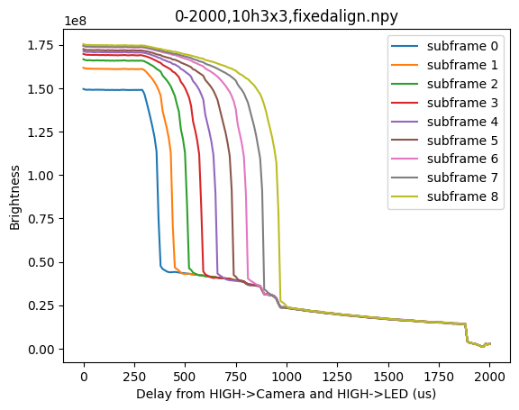
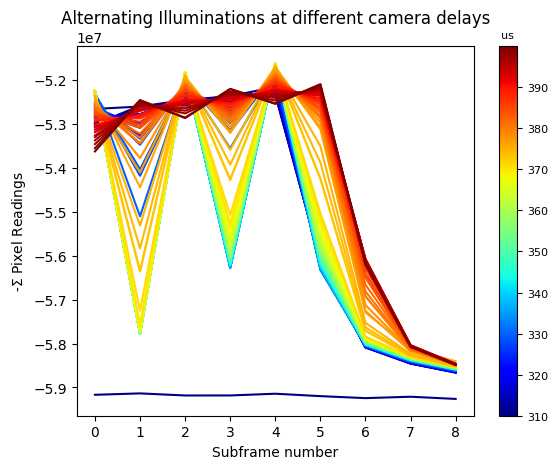
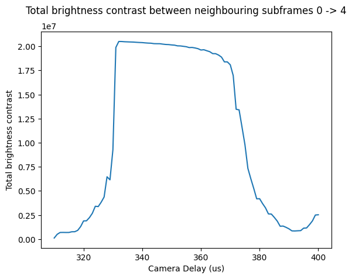

# hsi-timings

This repository contains experiments for measuring camera timings for the HSI coded camera project. We run experiments to:
1. Measure approximate camera delays 
2. Fine-tune camera delays

We define camera delay as the time it takes from setting a HIGH signal from the LED board, to the camera starting capture.

## Experiment 1: Approximate camera delays

## Setup
We set the camera start signal to HIGH, then wait $\Delta t$ microseconds before setting a single LED, facing the camera on. The LED remains on for a long time (much longer than the camera's subexposure). 

We then measure a brightness from the resultant signal by naively summing spatially across the image. The resultant brightness and $\Delta t$ should be initially flat at a high value, followed by a sharp fall off to 0, at which it remains. The flat, high brightness corresponds to the LED being turned on before exposure. The fall off corresponds to the LED being turned on mid-exposure. The flat, low brightness corresponds to the LED being turned on after exposure. The initial point of the fall off corresponds to the camera delay.

We collect simultaneous measurements by spatially multiplexing each subexposure with a 3x3 block mask. In this case, the initial point of the fall off for subexposure $i$ corresponds to the camera delay minus $(\text{subexposure duration}) \cdot i$. In this case, we set a subexposure duration of 80us.

We chose to use the RED LED, as it was measured to have the lowest rise and fall times in the `led-timings` experiments.

## Sample Arduino Code

The complete script is available in `offThenOn.ino`.

```
int led = ...;
int camDelay = ...;

void setup() {
    pinMode(led, OUTPUT);
}

void capture() {
    digitalWrite(cameraPin, HIGH);
    delayMicroseconds(delayUs);
    digitalWrite(chosenLed, HIGH);
    
    // After capture has completed for sure, then set everything back to low
    delayMicroseconds(fullExposureUs);
    digitalWrite(cameraPin, LOW);
    digitalWrite(chosenLed, LOW);
    delay(1000); // Acccount for fall time + readout
}

void loop() {
    if (when ready) {
        capture();
    }
}
```

## Results


Camera delays are approximately ~300us.

## Experiment 2: Fine-tuned camera delays

### Setup
We set a subexposure duration of 80us and spatially multiplex subexposures using a 3x3 block mask.


We set the camera start signal to HIGH, then wait $\Delta t$ microseconds before alternating a single LED on and off in intervals of (subexposure duration) 3 times.

If $\Delta t$ is aligned with the camera start delay, then subexposure 0 should be very bright, subexposure 1 shold be black, subexposure 2 should be very bright, and so on. Similar to experiment 1, we naively measure brightness by summing spatially across a frame.

The optimal camera start delay should have the maximal contrast between neighbouring subframes. We measure this by summing the absolute difference between brightnesses of the first 5 neighbouring subframes.

### Sample Arduino Code

```
int led = ...;
int camStartDelay = ...;

void setup() {
    pinMode(led, OUTPUT);
}

void sync() {
  digitalWrite(cameraPin, HIGH);
  int start = micros();
  int end = start + camStartDelay;
  while (micros() < end) {}

  start = micros();
  end = start + nOns * 2 * subExposureUs;
  int last_i = -2;
  int curr;
  bool isLedOn = false;

  while ((curr = micros()) < end) {
    int usSinceStart = curr - start;
    int i = usSinceStart / subExposureUs;
    int usTillNext = (i + 1) * subExposureUs - usSinceStart;

    if (isLedOn && usTillNext < fallTimeUs) {
      digitalWrite(led, LOW);
      isLedOn = false;
    }

    if (i == last_i + 2 && i < nOns * 2) {
      digitalWrite(led, HIGH);
      isLedOn = true;
      last_i = i;
    }
  }
}

void loop() {
    if (when ready) {
        sync();
    }
}
```

### Results





The optimal measured camera delay is 332us.
